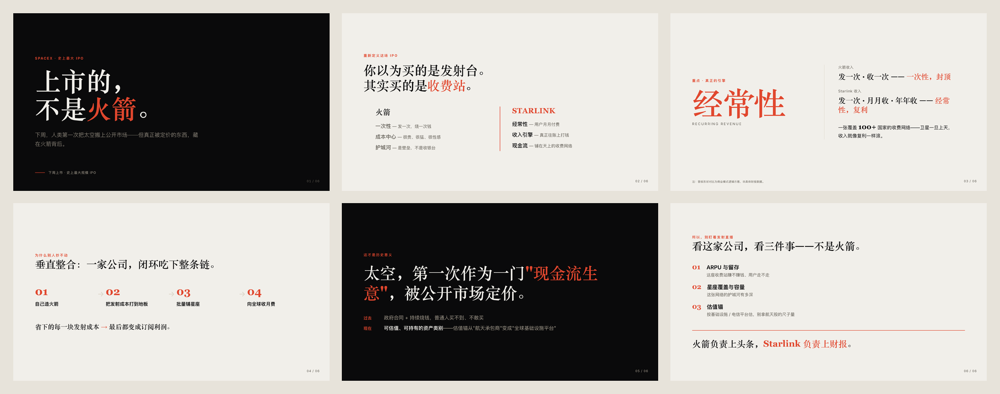

<!-- ★ LOGO（留给 Peng）：放字标/Logo，居中。<p align="center"></p> -->

<h1 align="center">Jumpx PPT Studio</h1>

<p align="center"><b>主题/资料进 → 确认大纲 → 选风格 → 模型直写 HTML → 在线预览 · 导出 · 演示。</b></p>
<p align="center">把 AI 幻灯 Skill 装进「人在环（HITL）」Web 工作台的单机应用 —— 你介入关键决策，模型做重活。</p>
<p align="center"><i>The human-in-the-loop web studio that turns the <a href="https://github.com/JumpX-Labs/jumpx-ppt-forge"><code>jumpx-ppt-forge</code></a> slide skill into a usable app.</i></p>

<p align="center">
  <a href="https://github.com/JumpX-Labs/jumpx-ppt-forge"></a>
  
  
  
</p>

<p align="center">
  <a href="#快速开始docker"><b>Docker 起</b></a> ·
  <a href="#它能做什么">能做什么</a> ·
  <a href="#架构一图">架构</a> ·
  <a href="https://github.com/JumpX-Labs/jumpx-ppt-forge">Skill 引擎</a> ·
  <a href="DEPLOYMENT.md">部署</a> ·
  <a href="#来自-jumpx-实战营">训练营</a>
</p>

<!-- ★ HERO（留给 Peng）：放一张工作台运行截图（大纲编辑器/实时工作台/演示模式三选一，或拼一张）。宽 ~860px。
<p align="center"></p> -->

> 👉 **Skill 本体**（提示词 / 门禁 / 渲染契约）在这里：[`jumpx-ppt-forge`](https://github.com/JumpX-Labs/jumpx-ppt-forge)。Studio 不重新实现任何生成逻辑——它把那套 Skill 跑起来、让人介入、把结果变成可看可导出可演示的成品。

`forge` 与 `studio` 是一套东西的两面：

| 仓库 | 角色 | 比喻 |
|---|---|---|
| [`jumpx-ppt-forge`](https://github.com/JumpX-Labs/jumpx-ppt-forge) | **引擎 / skill 本体** —— 质量门禁、提示资产、叙事/写稿/版式规范、HTML 渲染契约 | 锻造车间（forge） |
| **`jumpx-ppt-studio`**（本仓库） | **驱动这套 skill 的 Web 操作台** —— 交互界面、HITL 门禁、运行编排、预览/导出/演示 | 操作工作室（studio） |

Studio **不重新实现**任何幻灯生成逻辑。所有"怎么写得厚、版式怎么做、什么时候卡门禁"都来自 forge skill；Studio 负责把它跑起来、让人介入、把结果变成可看可导出可演示的成品。镜像在**构建时**从 `jumpx-ppt-forge` 拉取 skill 并烤进镜像，运行时无需单独下载。

---

## 它能做什么

- **主题 + 资料进**：粘贴文本 / 上传 PDF·Word·PPTX（markitdown 解析），可设篇幅 / 受众 / 语气。
- **人在环生成**：三道门禁可介入 —— 确认大纲（左树 + 故事板）、选模板、选渲染形态。
- **模型直写版面**：强模型按每页内容和角色**自由做版面设计**（自动画图表/曲线/插画、卡片、时间线），不是填模板。
- **样式导入**：上传一张参考图，视觉模型识别其风格 → 生成可复用样式预设。
- **导出与演示**：PDF（矢量）/ PNG（逐页）/ PPTX（逐页图）；内置双窗演示模式（借鉴 Slidev 教学习惯）。
- **单机 · 无账号 · 无登录**：一个容器对外一个端口，数据全在本机持久卷。

---

## 成品长这样（真实案例）

> 下面是 Studio 驱动的 **AI PPT Forge** 引擎端到端产出的真实成品——非示意图。在工作台里就是：**输入主题 → 确认大纲 → 选 `editorial-magazine` 模板 → 模型直写 HTML → 在线预览 / 导出 PDF·PPTX·PNG**。

**Case 01 · 观点型 editorial** ——「SpaceX 史上最大 IPO，但重点不是火箭」

<p align="center"></p>
<p align="center"><sub><i>6 页观点弧（封面 → 反框架 → 数字锚 → 闭环 → 金句 → 收尾）· 走完三道 HITL 门禁 · 渲染后可直接全屏演示与矢量导出。引擎与可复现源文件见 <a href="https://github.com/JumpX-Labs/jumpx-ppt-forge/tree/main/assets/examples/spacex-ipo">jumpx-ppt-forge / examples</a>。</i></sub></p>

<!-- ★ 案例库（留给 Peng / 持续补充）：每多一个成品复制一个 Case 块；图放 docs/cases/<slug>.png（建议宽 ~840px）。 -->

---

## 7 套风格，长这样

<!-- ★ 风格画廊（留给 Peng 拍板）：这些是真·模型按各风格产出的预览，仓库里已有现成图：
     backend/preset_previews/<style>-1.png（teaching-clean / editorial-magazine / swiss-system /
     blueprint / sketch-notes / corporate / creator-social）。确认要展示就把下面这张表去掉注释即可。
| teaching-clean | editorial-magazine | swiss-system | blueprint |
|:--:|:--:|:--:|:--:|
|  |  |  |  |
| **sketch-notes** | **corporate** | **creator-social** | |
|  |  |  | |
-->

> 7 套内置风格的预览图就在 `backend/preset_previews/`（前端"选模板"用的就是它们）。把上面注释去掉即成一面"风格墙"。

---

## 架构（一图）

```
浏览器 (:5180, Vite+React)
   │  /lg  ──────────────►  deepagents on LangGraph  (:2024)  ── 跑 forge skill + HITL 中断
   │  /api ──────────────►  recipe / runs / extract / styles API (:2025)
   │
   └─ 模型直写 HTML ── ai_render → index.html → 预览 / 导出(Playwright+Chromium) / 演示
```

一个 Docker 容器内跑三进程（前端 + 生成 agent + API），对外只开 **5180**。
**不能跑在 Vercel / Cloudflare Pages 等纯静态/serverless 平台** —— 它需要常驻进程、持久磁盘、无头 Chromium。详见 [`DEPLOYMENT.md`](./DEPLOYMENT.md)。

---

## 快速开始（Docker）

```bash
# 1. 准备密钥：复制示例并填入真实值（向开发者索取，切勿提交）
cp backend/.env.example backend/.env
#   需要：ARK_API_KEY / ARK_BASE_URL / ARK_MODEL / ARK_VISION_MODEL

# 2. 构建并启动（构建时自动从 jumpx-ppt-forge 拉 skill）
docker compose up -d --build

# 3. 打开
open http://localhost:5180
```

- 本地开发（不走 Docker）：见 [`RUN.md`](./RUN.md)。
- 完整部署/反向代理/资源要求：见 [`DEPLOYMENT.md`](./DEPLOYMENT.md)。

### 需要的环境变量（`backend/.env`）

| 变量 | 用途 |
|---|---|
| `ARK_API_KEY` | 火山方舟 API Key（**机密，不入库**） |
| `ARK_BASE_URL` | OpenAI 兼容接口地址 |
| `ARK_MODEL` | 主力文本/渲染模型 |
| `ARK_VISION_MODEL` | 样式导入用的视觉模型 |

> `backend/.env`（密钥）与 `backend/workspace/`（运行产物）均被 `.gitignore` 拦截，不在仓库内。

---

## 仓库结构

```
backend/        生成内核：LangGraph agent、slide_tools、ai_render、导出、API、样式导入
frontend/app/   Vite + React 操作台（输入 / 大纲编辑器 / 实时工作台 / 演示 / 样式库 / skill 页）
docker/         容器编排脚本
Dockerfile      单容器三进程镜像；构建时 git clone jumpx-ppt-forge 烤入 skill
docs/           工程文档，按授课模块组织（设计 / PRD / 实施 / Agent 控制 / 调研）
DEPLOYMENT.md   部署指南（交付运维）
RUN.md          本地开发跑法
```

> 📚 `docs/` 不只是开发笔记 —— 它按 **JumpX AI 实战营 · Week04 Vibe Coding** 的授课链路组织（设计 → PRD → 实施 → Agent 控制 → 调研）。想看一个真实 AI 产品从原型到上线怎么被想清楚、做出来，见 [`docs/README.md`](./docs/README.md)。

---

## 关系再强调一次

- 想看/改/下载 **skill 本体**（提示词、门禁、渲染契约）→ 去 [`jumpx-ppt-forge`](https://github.com/JumpX-Labs/jumpx-ppt-forge)。
- 想**用界面跑它、介入生成、导出演示** → 就是这里，`jumpx-ppt-studio`。

页面里展示的 skill、客户能下载的 skill、运行时实际驱动的 skill —— **是同一个**。

---

## 来自 JumpX 实战营

`forge`（引擎）+ `studio`（操作台）是 **JumpX AI 实战营 · Week04 Vibe Coding** 里"用 Agent 造真产品"的完整成果——从原型到上线的链路都在 [`docs/`](./docs/) 里摊开讲。

- 🖥️ **想直接用** → Docker 一条命令起（见上）。
- 🧩 **想要 skill 本体** → [`jumpx-ppt-forge`](https://github.com/JumpX-Labs/jumpx-ppt-forge)。
- 🎓 **想学会"把一个 AI 想法做成真产品"** → 来 JumpX AI 实战营。<!-- ★ 训练营报名链接（留给 Peng）：换成带链接的 CTA。 -->
- ⭐ 有用就点个 Star。

---

_Made by [JumpX Labs](https://github.com/JumpX-Labs)._
